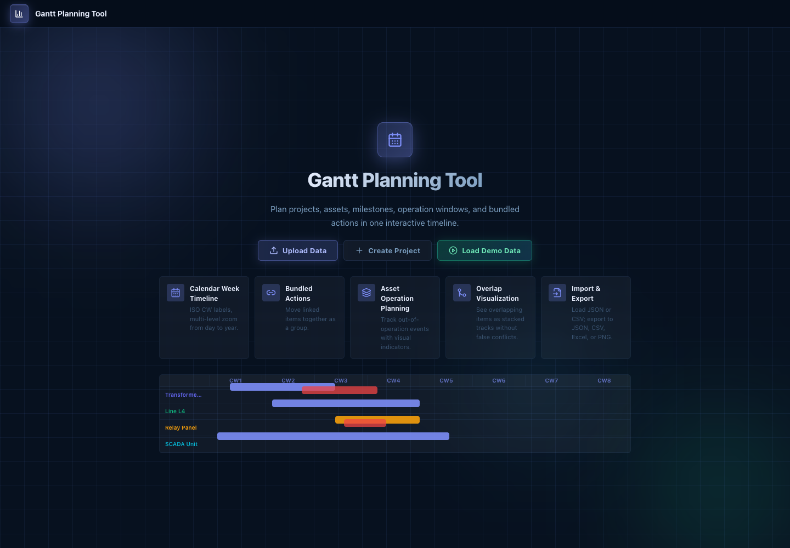
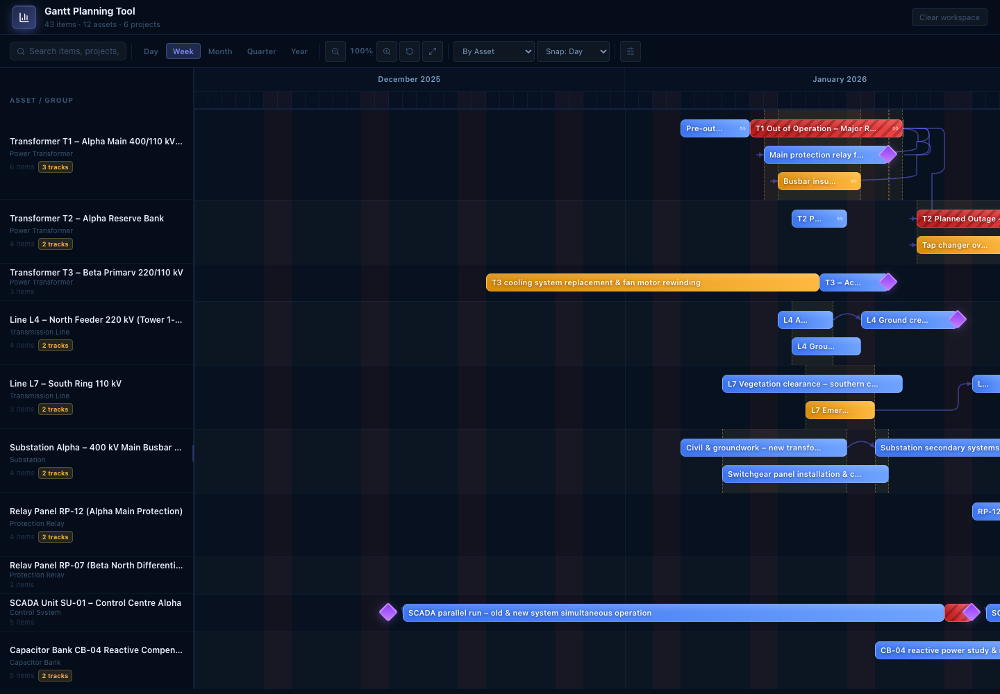
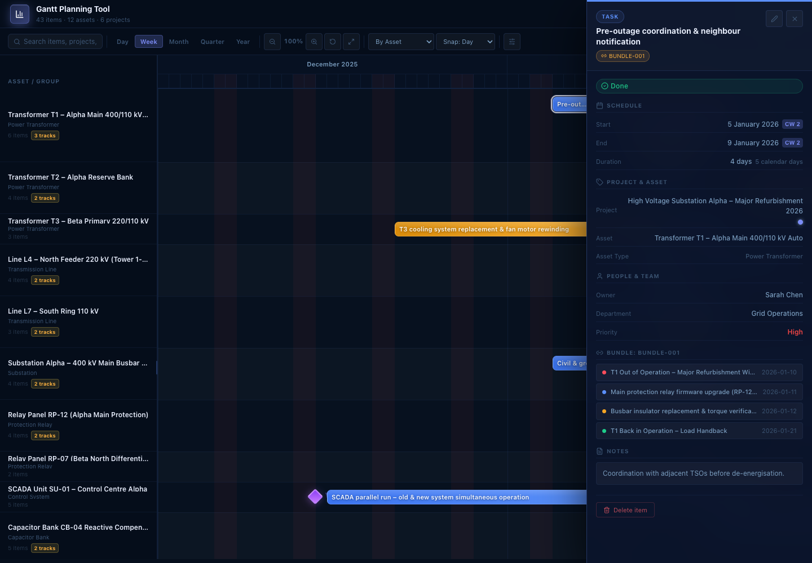

# Gantt Planning Tool

An interactive Gantt planner for coordinating projects, assets, milestones, outage windows, dependencies, and bundled work. It is designed for planning work across operational assets where timing, overlaps, handbacks, and team ownership need to stay visible.



## What You Can Do

- Build an asset-based planning board with projects, assets, and scheduled items.
- Import planning data from JSON or CSV.
- Load demo data to explore a realistic schedule immediately.
- Group the timeline by asset, project, department, owner, or status.
- Search across items, projects, owners, assets, and departments.
- Filter by project, asset, type, status, owner, department, bundled items, and overlapping items.
- Visualize overlapping work as stacked tracks in each row.
- Show dependency arrows between related schedule items.
- Move schedule bars directly on the timeline.
- Move bundled work together using shared bundle IDs.
- Open item details to review schedule, owner, priority, asset, project, notes, and bundle members.
- Add new items, projects, or assets from the UI.
- Undo and redo schedule edits.
- Export the plan to JSON, CSV, Excel, or PNG.

## Planning Board

The main board gives you a dense schedule view with a left-side asset or group list and a scrollable timeline on the right. Zoom presets let you move between day, week, month, quarter, and year views.



## Item Details

Click any bar or milestone to open the detail panel. From there you can inspect the schedule, update metadata, review bundle members, and delete an item when needed.



## Getting Started

Install dependencies:

```sh
npm install
```

Start the development server:

```sh
npm run dev
```

Build the production bundle:

```sh
npm run build
```

Preview the built app:

```sh
npm run preview
```

You can also use the helper scripts:

```sh
./build.sh
./start.sh
./zip-code.sh
```

PowerShell users can run:

```powershell
.\build.ps1
.\start.ps1
```

## Upload / Share Source Code

When sharing or uploading this project, upload only the source code and project configuration. Do not upload installed libraries, generated bundles, virtual environments, or operating-system metadata.

Use the source zip helper:

```sh
./zip-code.sh
```

That creates a clean archive such as `gantt-tool-source-YYYYMMDD-HHMMSS.zip`.

Include:

- `src/`
- `public/`
- `index.html`
- `package.json`
- `package-lock.json`
- `webpack.config.js`
- `README.md`
- helper scripts such as `build.sh`, `start.sh`, and `zip-code.sh`
- docs and screenshots under `docs/`

Do not include:

- `node_modules/`
- `dist/`
- `build/`
- `.venv/`, `venv/`, or `env/`
- `__pycache__/`
- `.git/`
- `.DS_Store`
- `__MACOSX/`
- `._*` AppleDouble files
- previously generated `.zip` archives

The receiver can restore libraries by running:

```sh
npm install
```

## Data Import

The tool accepts JSON and CSV files. JSON can use the canonical structure:

```json
{
  "projects": [],
  "assets": [],
  "items": [],
  "dependencies": []
}
```

Each item should include at least:

```json
{
  "id": "ITEM-001",
  "title": "Maintenance window",
  "start": "2026-01-05",
  "end": "2026-01-09",
  "type": "Task",
  "status": "Planned"
}
```

Dates use `YYYY-MM-DD` format. CSV import supports common columns such as `id`, `title`, `start`, `end`, `type`, `status`, `owner`, `department`, `priority`, `project_id`, `asset_id`, `bundle_id`, and `notes`.

## Useful Scripts

- `build.sh`: installs dependencies and creates the production `dist` bundle.
- `start.sh`: starts the preview server and builds first if needed.
- `build.ps1`: PowerShell build script for Windows or PowerShell Core.
- `start.ps1`: PowerShell start script for Windows or PowerShell Core.
- `zip-code.sh`: creates a clean source zip without macOS metadata, generated build output, `node_modules`, or virtualenv folders.

## Tech Stack

- React 18
- Webpack 5
- Framer Motion
- Lucide React icons
- SheetJS for Excel export
- html-to-image for PNG export
